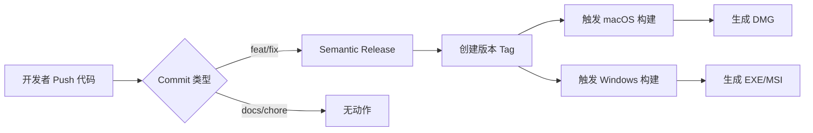

# GitHub Actions 工作流策略

## 🎯 优化后的工作流架构

### 1. **Semantic Release** (`release.yml`)
- **触发时机**: 
  - Push 到 main 分支（忽略文档和工作流文件变更）
  - 手动触发
- **作用**: 
  - 分析 commit 消息
  - 自动更新版本号
  - 创建 Git tag 和 GitHub Release
  - 触发构建工作流（通过 tag）

### 2. **macOS 构建** (`build-macos.yml`)
- **触发时机**: 
  - 推送版本 tag (v*)
  - repository_dispatch 事件
  - 手动触发
- **作用**: 构建和打包 macOS 应用

### 3. **Windows 构建** (`build-windows.yml`)
- **触发时机**: 
  - 推送版本 tag (v*)
  - repository_dispatch 事件
  - 手动触发
- **作用**: 构建和打包 Windows 应用

### 4. **已禁用** ~~(`build.yml`)~~
- 旧的构建工作流，已备份为 `build.yml.backup`
- 原因：与新工作流重复，使用过时的 actions

## 📊 工作流程图



## 🚀 使用指南

### 日常开发
```bash
# 普通提交（不触发构建）
git commit -m "chore: update dependencies"

# 触发版本发布和构建
git commit -m "feat: add new feature"  # Minor 版本
git commit -m "fix: bug fix"           # Patch 版本
```

### 手动触发
- 访问 Actions 页面
- 选择对应工作流
- 点击 "Run workflow"

## ⚙️ 配置说明

### 为什么这样设计？

1. **避免重复构建**: 只在真正发布版本时构建
2. **节省 CI 时间**: 文档更改不触发任何工作流
3. **清晰的职责分离**: 
   - Semantic Release 负责版本管理
   - Build 工作流负责打包
4. **灵活性**: 支持手动触发和自动触发

### 触发条件对比

| 工作流 | 之前 | 现在 | 节省 |
|--------|------|------|------|
| build.yml | 每次 push 到 main | 禁用 | 100% |
| release.yml | 每次 push 到 main | 忽略文档/配置文件 | ~30% |
| build-*.yml | 仅 tag | 仅 tag（不变） | - |

## 🔧 故障排除

### Q: 为什么我的 commit 没有触发构建？
A: 检查 commit 消息格式是否符合 Conventional Commits 规范

### Q: 如何跳过 CI？
A: 在 commit 消息中添加 `[skip ci]` 或 `[ci skip]`

### Q: 如何手动触发构建？
A: 
1. 方法一：手动创建 tag
   ```bash
   git tag v1.0.0
   git push origin v1.0.0
   ```
2. 方法二：使用 workflow_dispatch 在 GitHub Actions 页面手动触发

## 📝 维护建议

1. **定期清理**：删除旧的工作流运行记录
2. **监控成本**：GitHub Actions 有使用限制
3. **缓存优化**：定期更新依赖缓存
4. **安全更新**：及时更新 actions 版本