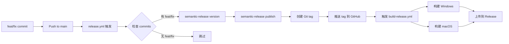

# 自动发布故障排查指南

## 🔴 问题：feat/fix commits 不会自动触发 tag 和编译

### 根本原因分析

#### 1. **Semantic Release 没有执行 publish 命令** ❌
```yaml
# 之前的错误配置
- name: Python Semantic Release
  run: |
    poetry run semantic-release version  # 只更新版本号
    # 缺少: poetry run semantic-release publish
```

**问题**：`version` 命令只是计算并更新版本号，不会创建和推送 Git tag。

#### 2. **Git 推送权限问题** ❌
```
Error: remote: Permission to MarkShawn2020/volcengine-s2s-demo-py.git denied
fatal: unable to access 'https://github.com/...': The requested URL returned error: 403
```

**问题**：使用 HTTPS URL 时，GITHUB_TOKEN 权限不足或配置错误。

#### 3. **工作流触发链断裂** ❌
```
feat commit → semantic-release → ❌ 没有创建 tag → 构建不触发
```

## ✅ 解决方案（已实施）

### 1. 修复 release.yml 工作流

```yaml
# 正确的配置
- name: Python Semantic Release
  env:
    GH_TOKEN: ${{ secrets.GITHUB_TOKEN }}
  run: |
    poetry run semantic-release version   # 更新版本
    poetry run semantic-release publish   # 创建并推送 tag ✅
```

### 2. 确保正确的权限

```yaml
permissions:
  contents: write    # 允许推送 tag
  pull-requests: write
  issues: write
  actions: write    # 允许触发其他工作流
```

### 3. 使用 SSH 而非 HTTPS

```bash
# 推荐：使用 SSH URL
git remote set-url origin git@github.com:MarkShawn2020/volcengine-s2s-demo-py.git
```

## 📊 完整的自动化流程



## 🧪 验证自动化是否工作

### 快速诊断
```bash
./scripts/diagnose_release.sh
```

### 手动测试流程

1. **创建符合规范的 commit**
```bash
# 创建一个测试文件
echo "test" > test.txt
git add test.txt
git commit -m "feat: add test feature for automatic release"
```

2. **推送到 main**
```bash
git push origin main
```

3. **观察 GitHub Actions**
- 访问: https://github.com/MarkShawn2020/volcengine-s2s-demo-py/actions
- 应该看到:
  - ✅ "Semantic Release" 工作流运行
  - ✅ "Build and Release" 工作流自动触发

4. **检查结果**
- Tags: https://github.com/MarkShawn2020/volcengine-s2s-demo-py/tags
- Releases: https://github.com/MarkShawn2020/volcengine-s2s-demo-py/releases

## ❓ 常见问题

### Q1: 为什么我的 commit 没有触发发布？

**检查 commit 消息格式**：
```bash
# ✅ 正确格式
git commit -m "feat: 新功能"
git commit -m "fix: 修复问题"
git commit -m "feat(scope): 带作用域的功能"

# ❌ 错误格式
git commit -m "add feature"      # 缺少类型前缀
git commit -m "feat 新功能"      # 缺少冒号
git commit -m "FEAT: 新功能"     # 类型必须小写
```

### Q2: release.yml 运行了但没有创建 tag？

**检查日志**：
1. 查看 "Check if release is needed" 步骤
2. 查看 "Python Semantic Release" 步骤
3. 如果显示 "No release needed"，说明没有符合规范的 commits

### Q3: tag 创建了但构建没有触发？

**可能原因**：
1. build-release.yml 文件有语法错误
2. Tag 格式不符合 `v*` 模式
3. GitHub Actions 权限问题

**解决方法**：
```bash
# 手动重新推送 tag
git push origin :refs/tags/v1.0.0  # 删除远程 tag
git push origin v1.0.0              # 重新推送
```

### Q4: 如何跳过自动发布？

在 commit 消息中添加 `[skip ci]` 或 `[ci skip]`：
```bash
git commit -m "chore: update docs [skip ci]"
```

## 📝 Commit 类型速查表

| 类型 | 版本变化 | 何时使用 |
|------|---------|----------|
| `feat` | Minor (0.X.0) | 新功能 |
| `fix` | Patch (0.0.X) | Bug 修复 |
| `perf` | Patch (0.0.X) | 性能优化 |
| `docs` | 无 | 文档更新 |
| `style` | 无 | 代码格式 |
| `refactor` | 无 | 重构 |
| `test` | 无 | 测试 |
| `chore` | 无 | 构建/工具 |
| `feat!` | Major (X.0.0) | 破坏性变更 |

## 🔧 调试命令

### 查看 semantic-release 会做什么
```bash
# 干运行（不实际执行）
poetry run semantic-release version --dry-run

# 查看当前版本
poetry run semantic-release version --print

# 查看上一个发布版本
poetry run semantic-release version --print-last-released
```

### 手动触发发布
```bash
# 强制 patch 版本
poetry run semantic-release version --patch

# 强制 minor 版本
poetry run semantic-release version --minor

# 强制 major 版本
poetry run semantic-release version --major
```

## 📊 状态检查清单

- [ ] Git 用户配置正确
- [ ] 使用 SSH URL（推荐）
- [ ] release.yml 包含 `publish` 命令
- [ ] 权限配置包含 `contents: write`
- [ ] 最近有符合规范的 commits
- [ ] build-release.yml 存在且语法正确

## 🚀 最终验证

运行诊断脚本，确保所有检查通过：
```bash
./scripts/diagnose_release.sh
```

如果显示 "✅ 所有检查通过"，那么自动化流程应该正常工作！