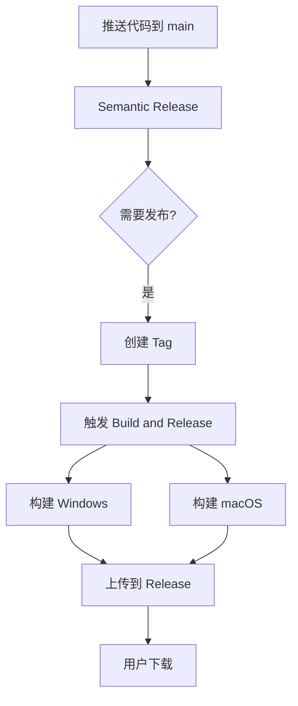

# 构建和发布指南

## 🎯 问题诊断

### 为什么 Release 中没有 .exe 和 .dmg 文件？

原因：
1. `semantic-release` 只创建了 tag 和空的 Release
2. 构建工作流没有被正确触发
3. 构建产物没有上传到 Release

## ✅ 解决方案

### 新增统一构建工作流

创建了 `.github/workflows/build-release.yml`，它会：
1. 在 tag 推送时自动触发
2. 并行构建 Windows 和 macOS
3. 自动上传产物到 GitHub Release

### 触发构建的方法

#### 方法 1：为现有 tag 触发构建
```bash
# 使用脚本
./scripts/trigger_build.sh

# 或手动操作
git push origin :refs/tags/v1.0.0  # 删除远程 tag
git push origin v1.0.0              # 重新推送
```

#### 方法 2：创建新 tag
```bash
git tag v1.0.1
git push origin v1.0.1
```

#### 方法 3：手动触发（推荐）
1. 访问 [GitHub Actions](https://github.com/MarkShawn2020/volcengine-s2s-demo-py/actions)
2. 选择 "Build and Release" 工作流
3. 点击 "Run workflow"
4. 输入版本号（可选）
5. 点击运行

## 📊 工作流架构



## 🚀 完整发布流程

### 自动化流程
1. **开发**: 使用规范的 commit 消息
   ```bash
   git commit -m "feat: 新功能"
   git push origin main
   ```

2. **版本管理**: Semantic Release 自动
   - 分析 commits
   - 更新版本号
   - 创建 tag
   - 创建 Release

3. **构建**: Build and Release 工作流
   - 检测到新 tag
   - 构建 Windows .exe
   - 构建 macOS .dmg
   - 上传到 Release

### 手动补救

如果自动流程失败，可以手动触发：

```bash
# 1. 检查现有 tag
git tag -l "v*"

# 2. 为最新 tag 触发构建
./scripts/trigger_build.sh

# 3. 或直接在 GitHub Actions 页面手动触发
```

## 📦 构建产物

每个 Release 包含：

| 文件 | 平台 | 说明 |
|------|------|------|
| `VolcengineVoiceChat-{version}-Windows.zip` | Windows | 便携版可执行文件 |
| `VolcengineVoiceChat-{version}-macOS.dmg` | macOS | 磁盘镜像安装包 |
| `checksums.txt` | 所有 | SHA256 校验和 |

## 🛠️ 故障排除

### 构建没有触发
- 检查 tag 格式是否为 `v*`
- 确认 tag 已推送到远程
- 查看 Actions 页面是否有运行记录

### 构建失败
- 检查 Python 版本（需要 3.11）
- 确认系统依赖已安装（portaudio）
- 查看 Actions 日志详情

### Release 没有产物
- 确认构建成功完成
- 检查 upload-artifact 步骤
- 验证 create-release 步骤

## 📝 配置文件

### 主要工作流
- `.github/workflows/release.yml` - 版本管理
- `.github/workflows/build-release.yml` - 构建和发布
- ~~`.github/workflows/build-macos.yml`~~ - 可以删除
- ~~`.github/workflows/build-windows.yml`~~ - 可以删除

### 辅助脚本
- `scripts/trigger_build.sh` - 手动触发构建
- `scripts/check_workflows.sh` - 检查工作流状态
- `scripts/validate_workflows.py` - 验证 YAML 语法

## 💡 最佳实践

1. **使用统一的构建工作流** - 维护更简单
2. **手动触发作为备份** - 自动化失败时的保障
3. **定期清理旧 Release** - 节省存储空间
4. **测试构建后再发布** - 使用 workflow_dispatch 先测试

## 🔗 相关链接

- [GitHub Actions](https://github.com/MarkShawn2020/volcengine-s2s-demo-py/actions)
- [Releases](https://github.com/MarkShawn2020/volcengine-s2s-demo-py/releases)
- [Semantic Release 文档](docs/SEMANTIC_RELEASE.md)