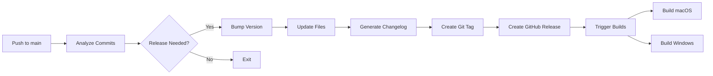

# Semantic Release Configuration

This project uses **python-semantic-release** for automated versioning and release management.

## How It Works

1. **Commit Analysis**: Every commit to `main` branch triggers semantic-release
2. **Version Determination**: Based on commit messages, determines if a release is needed and what type (major/minor/patch)
3. **Automated Updates**: Updates version in multiple files automatically
4. **Release Creation**: Creates GitHub releases with changelogs
5. **Build Triggering**: Automatically triggers macOS and Windows builds

## Workflow



## Configuration Files

### 1. `pyproject.toml`
Contains semantic-release configuration under `[tool.semantic_release]`:
- Version patterns and locations
- Commit parsing rules
- Build commands
- Release settings

### 2. `.github/workflows/release.yml`
GitHub Actions workflow that runs semantic-release on every push to main

### 3. `.commitlintrc.json`
Commit message validation rules (optional, for PR checks)

### 4. `CONTRIBUTING.md`
Guidelines for writing proper commit messages

## Version Locations

Versions are automatically updated in:
- `pyproject.toml` - `[project].version`
- `src/__init__.py` - `__version__`

## Commit Message Format

Follow [Conventional Commits](https://www.conventionalcommits.org/):

```
<type>(<scope>): <subject>

<body>

<footer>
```

### Quick Reference

| Type | Version Bump | Example |
|------|-------------|---------|
| `feat` | Minor (0.X.0) | `feat: add voice detection` |
| `fix` | Patch (0.0.X) | `fix: resolve timeout issue` |
| `perf` | Patch (0.0.X) | `perf: optimize audio buffer` |
| `BREAKING CHANGE` | Major (X.0.0) | `feat!: redesign API` |
| `docs`, `style`, `refactor`, `test`, `build`, `ci`, `chore` | None | `docs: update README` |

## Manual Commands

### Check Current Version
```bash
poetry run semantic-release version --print
```

### Preview Next Version (Dry Run)
```bash
poetry run semantic-release version --dry-run
```

### Force a Release (Manual)
```bash
poetry run semantic-release version --force
```

### Generate Changelog Only
```bash
poetry run semantic-release changelog
```

## Troubleshooting

### No Release Created
- Check commit messages follow convention
- Ensure commits have proper type (`feat`, `fix`, etc.)
- Verify you're on the `main` branch

### Version Not Updated
- Check file paths in `version_variables` configuration
- Ensure files exist and have correct format
- Verify Poetry is installed and configured

### Build Not Triggered
- Check GitHub Actions permissions
- Verify `repository_dispatch` event is configured
- Ensure GITHUB_TOKEN has proper permissions

## Release Process

### Automatic (Recommended)
1. Create feature branch
2. Make changes
3. Commit with conventional message:
   ```bash
   git commit -m "feat(audio): add noise reduction"
   ```
4. Create PR to main
5. Merge PR
6. Semantic-release automatically:
   - Analyzes commits
   - Bumps version
   - Creates release
   - Triggers builds

### Manual Override
If needed, you can manually trigger a release:

```bash
# From main branch
git pull origin main
poetry run semantic-release version
poetry run semantic-release publish
```

## Best Practices

1. **One Type Per Commit**: Don't mix features and fixes in one commit
2. **Clear Descriptions**: Write clear, concise commit messages
3. **Use Scopes**: Add scope for clarity (`feat(audio):` vs just `feat:`)
4. **Breaking Changes**: Always document breaking changes in footer
5. **No Manual Versions**: Never manually edit version numbers

## Environment Variables

For CI/CD, these are automatically configured:
- `GH_TOKEN` or `GITHUB_TOKEN` - For GitHub API access
- `PYPI_TOKEN` - For PyPI publishing (if enabled)

## Examples

### Feature Release (Minor Version)
```bash
git commit -m "feat(adapter): add WebRTC support for browser adapter"
# Results in: 0.1.0 → 0.2.0
```

### Bug Fix (Patch Version)
```bash
git commit -m "fix(volcengine): handle connection timeout properly"
# Results in: 0.2.0 → 0.2.1
```

### Breaking Change (Major Version)
```bash
git commit -m "feat!: redesign adapter interface

BREAKING CHANGE: Adapter.connect() now returns Promise instead of callback"
# Results in: 0.2.1 → 1.0.0
```

### Multiple Commits
```bash
git commit -m "fix: memory leak in audio buffer"
git commit -m "feat: add voice activity detection"
git commit -m "docs: update API documentation"
# Results in: Minor version bump (highest change wins)
```

## Integration with Build Workflows

The build workflows (`build-macos.yml`, `build-windows.yml`) are triggered:
1. When a tag is pushed (format: `v*`)
2. Via `repository_dispatch` event from semantic-release
3. Manually via workflow_dispatch

This ensures builds only happen for actual releases, not every commit.

## Monitoring

Check release status:
- GitHub Actions: `.../actions/workflows/release.yml`
- Releases page: `.../releases`
- Tags: `.../tags`

## Resources

- [python-semantic-release Documentation](https://python-semantic-release.readthedocs.io/)
- [Conventional Commits Specification](https://www.conventionalcommits.org/)
- [Semantic Versioning](https://semver.org/)
- [Angular Commit Convention](https://github.com/angular/angular/blob/main/CONTRIBUTING.md#commit)